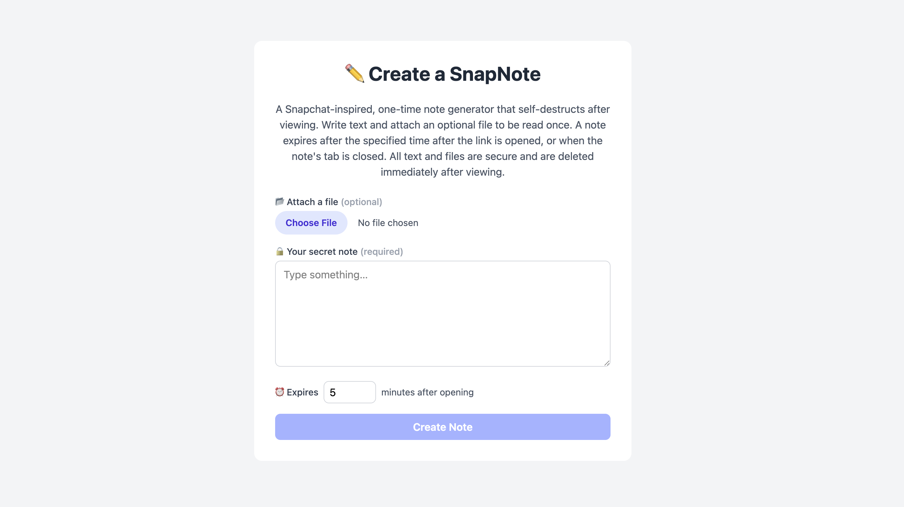
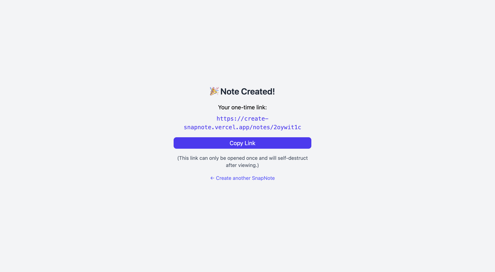

# SnapNote: One-Time Note Generator
A Snapchat-inspired, one-time note generator that self-destructs after viewing. 

Write text and attach an optional file to be read once. A note expires after the specified time after the link is opened, or when the note's tab is closed. All text and files are secure and are deleted immediately after viewing. 

---

## Technologies
Full-stack project using the MERN tech stack.
- **Frontend**: React, Tailwind CSS
- **Backend**: Node.js, Express.js
- **Database**: MongoDB (note schema), Supabase (file storage)
- **Deployment**: Vercel (frontend), Render (backend)

---

## Features
- **One-time viewable notes**: text and file entries are deleted after viewing
- **Auto-expiring notes**: notes expire after a countdown (expiry time set by note creator) or when the user closes the tab
- **File attachments**: file uploads with smart image/PDF previews
- **Modern UX**: intuitive UI, copy-to-clipboard, easy navigation

---

## Live Link & Screenshots
[https://create-snapnote.vercel.app/](https://create-snapnote.vercel.app/)





---

## Setup
```bash
# clone repo
git clone https://github.com/nmchong/snapnote.git
cd snapnote

# frontend setup
cd frontend
npm install
npm start

# backend setup (in a new terminal)
cd backend
npm install
npm start
```
#### Environment Variables

Frontend (frontend/.env)
```bash
REACT_APP_API_URL=your_backend_url
```

Backend (backend/.env)
```bash
PORT=5001
SUPABASE_URL=your_supabase_url
SUPABASE_SERVICE_KEY=your_supabase_service_key
MONGO_URI=your_mongodb_uri
```
